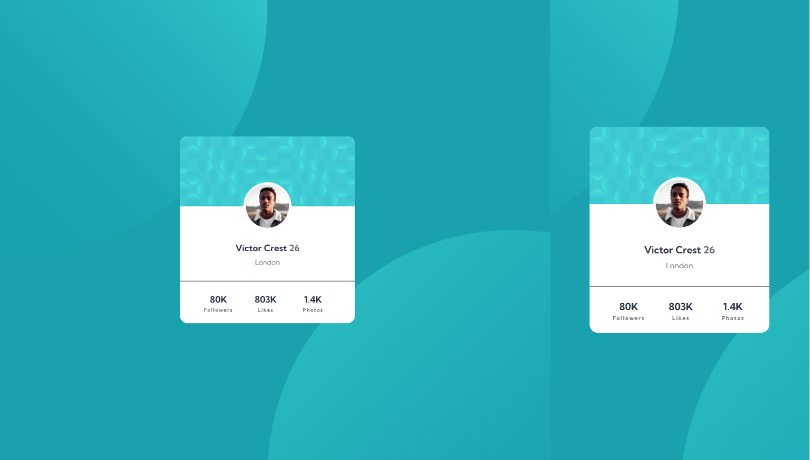

# Frontend Mentor - Profile Card Component 

This is a solution to the [Profile Card Component  challenge on Frontend Mentor](https://www.frontendmentor.io/challenges/profile-card-component-cfArpWshJ).

## Table of contents

- [Frontend Mentor - Profile Card Component](#frontend-mentor---profile-card-component)
  - [Table of contents](#table-of-contents)
  - [Overview](#overview)
    - [Screenshot](#screenshot)
    - [Links](#links)
  - [My process](#my-process)
    - [Built with](#built-with)
  - [Author](#author)

## Overview

### Screenshot

### Links

- Solution URL: [Frontend Mentor](https://www.frontendmentor.io/solutions/profile-card-component-UQk6UcOe7A)
- Live Site URL: [Github Pages](https://cozymeds.github.io/profile-card-component/)

## My process

### Built with

- Semantic HTML5 markup
- CSS custom properties
- Flexbox
- Mobile-first workflow
- [Styled Components](https://styled-components.com/) - For styles

## Author

- Frontend Mentor - [@Erratic56](https://www.frontendmentor.io/profile/Erratic56)
